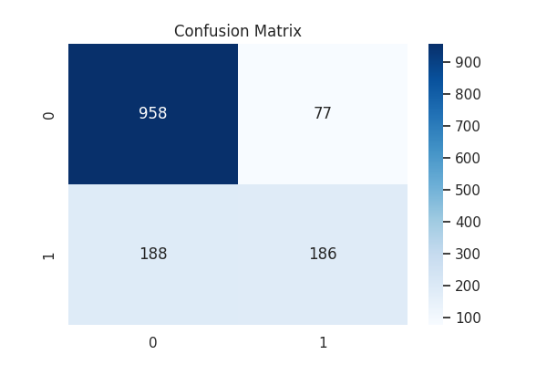
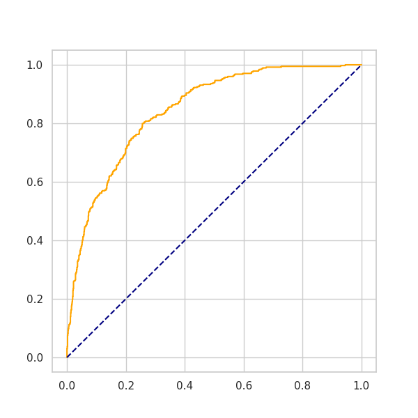

# 📊 Telco Customer Churn Prediction

## 📌 Project Overview
Customer churn refers to customers discontinuing a service. Accurately predicting churn allows businesses to take proactive retention measures and reduce revenue loss.

In this project, we build a tabular machine learning pipeline to predict whether a customer will churn (Yes/No) using the Telco Customer Churn dataset from Kaggle. Multiple models are trained and evaluated with proper handling of class imbalance, and results are compared using robust evaluation metrics.

## 📂 Dataset
- **Source:** Kaggle – Telco Customer Churn
- **Samples:** ~7,000 customers
- **Target Variable:** Churn (0 → No churn, 1 → Churn)
- **Features:** 
    - Customer demographics (gender, senior citizen)
    - Account information (tenure, contract type)
    - Services used (internet, phone, streaming)
    - Billing information (MonthlyCharges, TotalCharges)

## 🧹 Data Preprocessing
The following preprocessing steps were applied to handle data inconsistencies:
- **Missing Values:** Replaced blank values in `TotalCharges` with the column median.
- **Categorical Cleanup:** Unified "No internet service" and "No phone service" into "No" to reduce noise.
- **Feature Engineering:** 
    - Created `Service_Count` (Total services per customer).
    - Created `High_Risk_Group` (Month-to-month contracts for Fiber Optic users).
- **Encoding:** Applied Label Encoding for categories and converted target to binary.
- **Scaling:** Applied `StandardScaler` to ensure consistency for baseline models.

## 🔀 Train / Validation Split Method
- **Split Strategy:** Stratified Train–Test Split
- **Train Size:** 80% | **Test Size:** 20%
- **Reason:** Stratification preserves the original churn class distribution, preventing biased evaluation.

## 🤖 Models Trained
The following models were compared in the pipeline:
1. **Logistic Regression** (Baseline)
2. **XGBoost Classifier** (Improved)
3. **LightGBM** (Improved)
4. **Voting Ensemble** (Final Production Model)

## 📏 Evaluation Metrics
For each model, we report:
- Accuracy, Precision, Recall, F1-score, and ROC–AUC Score.

📌 **Why Recall Matters Most:** In churn prediction, missing a churner is more costly than incorrectly flagging a loyal customer. Therefore, recall and F1-score for the churn class are prioritized.

## 🏆 Best Result
🔥 **Best Performing Model: Triple-Threat Voting Ensemble**

| Metric | Value |
| :--- | :--- |
| **ROC–AUC** | **0.8468** |
| **Accuracy** | **81.19%** |
| **Precision (Churn)** | **0.70** |
| **Recall (Churn)** | **0.50** |

## 📊 Visual Analysis

### Confusion Matrix


### ROC Curve


## 📊 Model Comparison Summary (ROC–AUC)
| Model | ROC–AUC |
| :--- | :--- |
| **Voting Ensemble** | **0.846** |
| **XGBoost** | **0.844** |
| **Logistic Regression** | **0.804** |

## ▶️ How to Run

### Option 1: Run the ML Pipeline (Scripts)
1. **Install dependencies:**
   ```bash
   pip install -r requirements.txt
2. **Run the pipeline:**
   ```bash
python main.py

## Option 2: 📘 Explore the Analysis (Notebook)

Open `telco_churn_analysis(20.ipynb` in Jupyter or Kaggle to view the detailed Exploratory Data Analysis and step-by-step model development.

## ✅ Key Takeaways

- **Consistency:** Normalizing service categories reduced feature noise significantly.  
- **Ensemble Power:** Combining XGBoost and LightGBM provided the most robust separation.  
- **Recall Priority:** Focused on maximizing churn recall to assist business retention strategies.

  
 ## 📁 Project Structure
```text
telco-churn-project/
│
├── data/
│   └── Telco.csv               # Raw dataset from Kaggle
│
├── src/                        # Source code for the ML pipeline
│   ├── __init__.py             # Makes src a Python package
│   ├── data_loader.py          # Script for data ingestion
│   ├── preprocessing.py        # Data cleaning & feature engineering
│   ├── data_processor.py       # Scaling & Train-test split logic
│   ├── models.py               # Model architectures (XGB, RF, LR)
│   └── evaluation.py           # Metric calculation & plot generation
│
├── results/                    # Output directory
│   ├── figures/                # All Confusion Matrices & ROC Curves
│   └── metrics/                # Text reports & summary.csv
│
├── .gitattributes              # Git LFS/line-ending configuration
├── LICENSE                     # MIT License
├── README.md                   # Project documentation & final report
├── main.py                     # Execution script for the full pipeline
├── telco_churn_analysis.ipynb  # Updated Kaggle Notebook (EDA)
├── processed_data.csv          # Cleaned and encoded data output
└── requirements.txt            # Project dependencies


